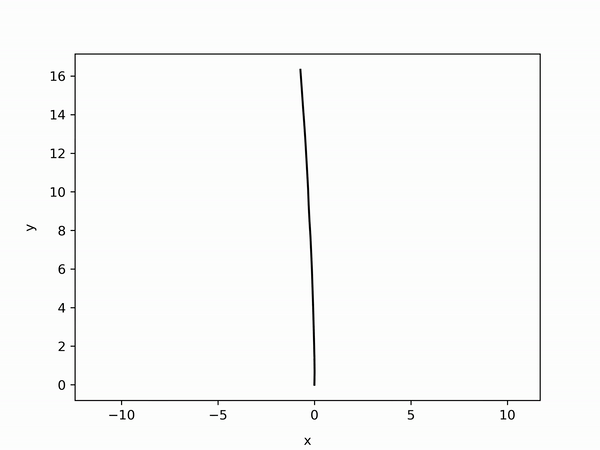
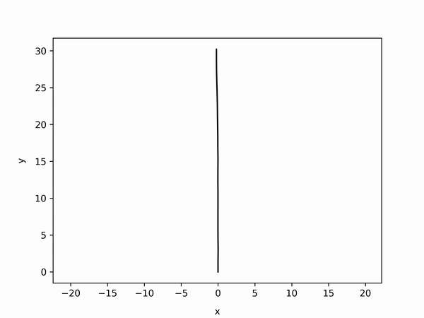
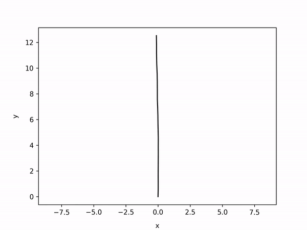
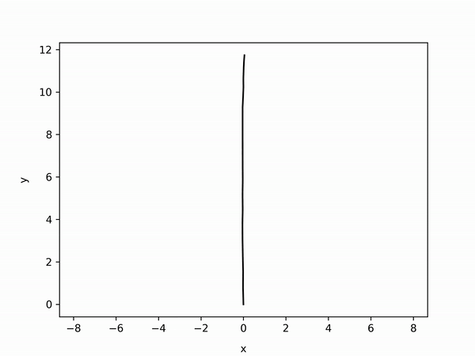

  <h1>SOLiD-PyICP-SLAM</h1>
  
  
  
  
  
   
   

* SOLiD (Spatially Organized and Lightweight global Descriptor for LiDAR Place Recognition) based Full Python based SLAM
* We estimate odometry using Point2Plane ICP in Open3D and optimize the pose graph using GTSAM.
* Prerequisite
  * [SOLiD](https://github.com/sparolab/solid) (Spatially Organized and Lightweight global Descriptor for LiDAR Place Recognition)
  * GTSAM
    <pre>
    <code>
    $ pip3 install gtsam
    </code>
    </pre>  

  * OPEN3D
    <pre>
    <code>
    $ pip3 install open3d
    </code>
    </pre>  

  * FFMPEG
    <pre>
    <code>
    $ sudo apt install ffmpeg
    </code>
    </pre>  

## Run
0. Download SOLiD-PyICP-SLAM.
<pre>
<code>
$ git clone https://github.com/sparolab/SOLiD-PyICP-SLAM.git
</code>
</pre>  

1. Download KITTI in Datasets Folder.
<pre>
<code>
$ mkdir Datasets
</code>
</pre>  

2. Just RUN!!
<pre>
<code>
$ python3 main.py
</code>
</pre>  

## Results
In sequence 00, 02, 05 and 08.  
   

## Special Thanks
Thank you  for providing base code.
